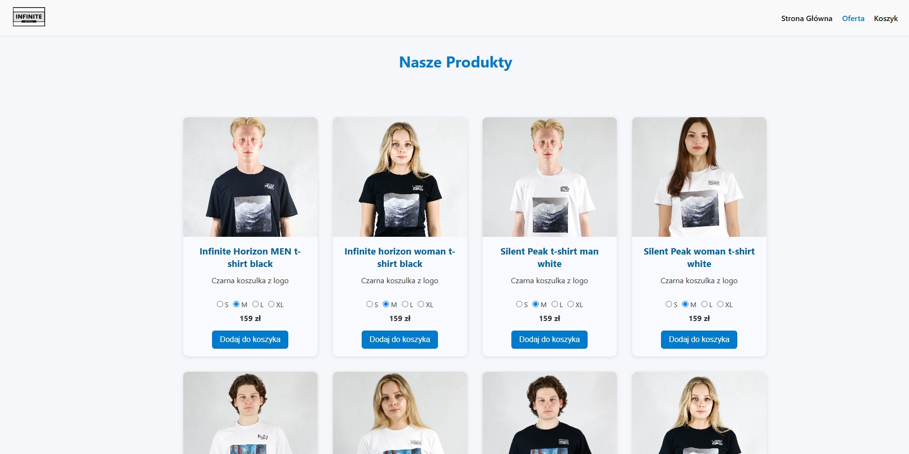

<h1 align="center">Hi 👋, I'm Jakub Duda!</h1>
<h3 align="center">🎓 Computer Science Student | 💻 IT Technician | 🔧 Web Development Enthusiast | 🧑‍💼 Freelancer</h3>

---

### 🧑‍💻 About Me

- 🎓 I'm currently studying **Computer Science** at a technical university  
- 🧰 I graduated from a technical high school as an **IT Technician**  
- 💼 I work as a **freelancer** on fullstack projects  
- 🌱 Currently learning **advanced backend and DevOps**  
- 🚀 Passionate about building modern web applications  
- 📫 Contact me at: **gpro6833@gmail.com**

---

### 🛠 Technologies & Tools I Use

  
  
  
  
  
  
  
  
  
  
  

---

### 🚀 Featured Project

#### 🛒 [infiniteapparelwear.com](https://infiniteapparelwear.com)

> A modern **e-commerce clothing store** built with:
>
> - 🟢 **Node.js** – backend logic and routing  
> - 💳 **Stripe** – secure payment gateway integration  
> - 🧱 **EJS** – templating engine for dynamic HTML rendering  
> - 🍃 **MongoDB** – NoSQL database for storing products and users  
>
> Built from scratch as a fullstack project for real-world deployment. Live and fully functional!

  

### 📊 GitHub Stats

  

---

### 🌐 Where to Find Me

- [LinkedIn](https://www.linkedin.com/in/jakub-duda-9b272b33a/)  
- [Portfolio](https://szczupak.dev/)

---

_📁 This profile is under active development – thanks for visiting!_
